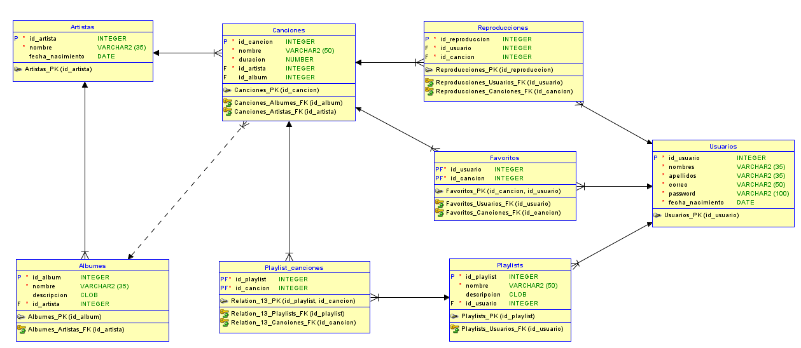
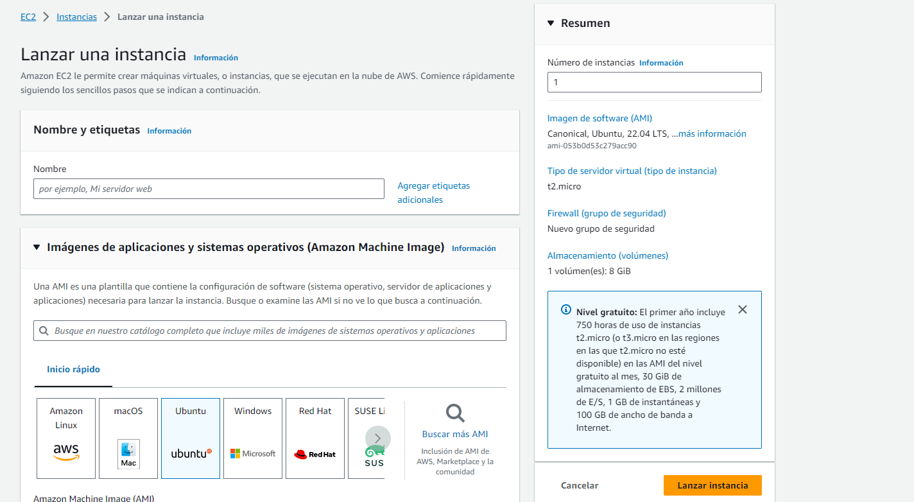
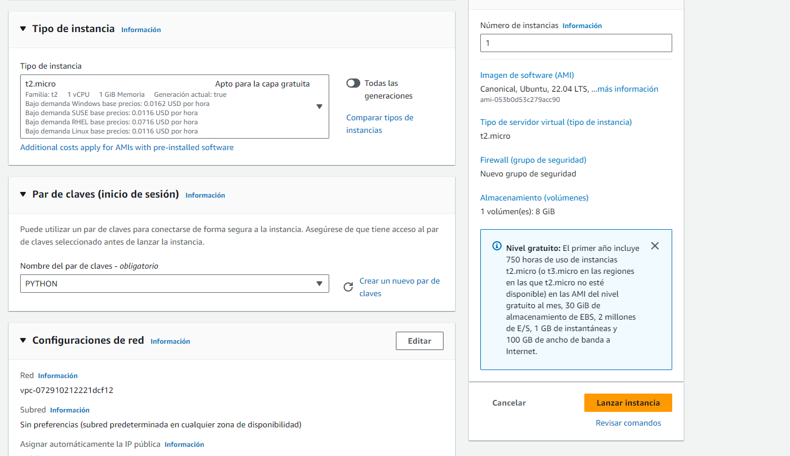
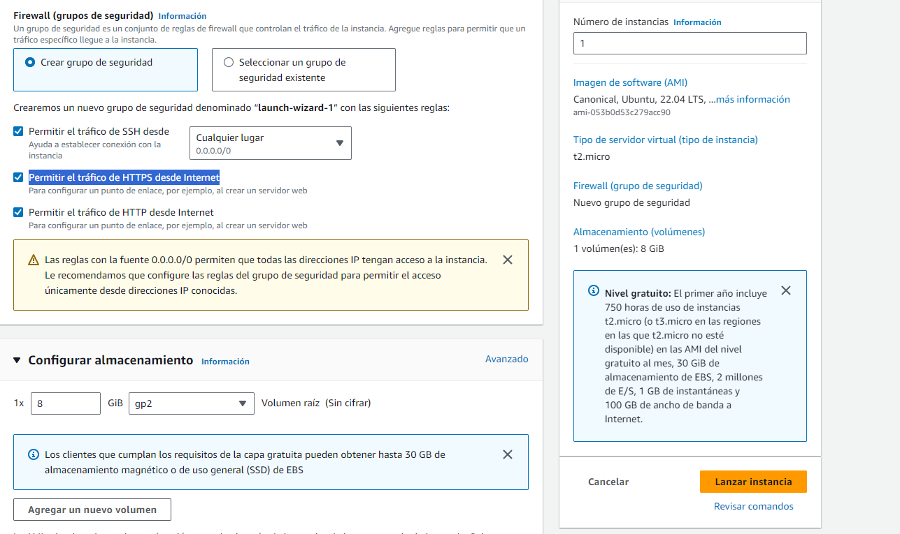
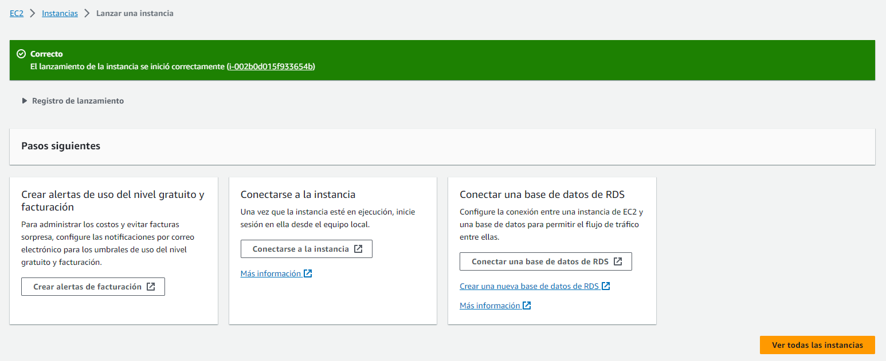
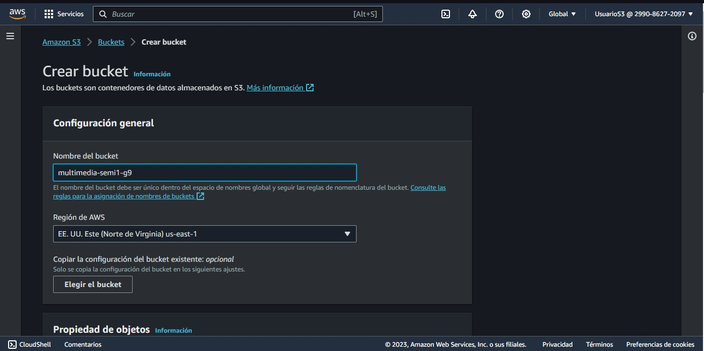

# Manual técnico 

# Objetivos del Proyecto

## Objetivo General
Implementar una arquitectura de aplicación web de transmisión de música que utilice servicios de AWS, incluyendo S3, EC2, un balanceador de carga, una base de datos (RDS o DynamoDB) y IAM para garantizar la escalabilidad, disponibilidad y seguridad de la aplicación.

## Objetivos Específicos

1. **Despliegue en S3:** Configurar un bucket de S3 con el nombre "sound-stream-semi1-g#" para alojar la aplicación web estática.

2. **Almacenamiento Multimedia:** Configurar otro bucket de S3 llamado "multimedia-semi1-g#" con dos carpetas ("Fotos" y "Canciones") para almacenar imágenes de perfil, arte de artistas, álbumes, playlists y archivos MP3.

3. **Implementación de Servidores EC2:** Configurar dos instancias EC2 con servidores idénticos en Node.js y Python que alojen la lógica de la aplicación web.

4. **Seguridad en EC2:** Asegurar que los Security Groups de las instancias EC2 estén configurados adecuadamente, habilitando solo los puertos necesarios para la aplicación y garantizando su seguridad.

5. **Configuración de Load Balancer:** Implementar un balanceador de carga para distribuir el tráfico entre las dos instancias EC2 y asegurar la alta disponibilidad de la aplicación.

6. **Base de Datos RDS o DynamoDB:** Configurar y utilizar una instancia de RDS o DynamoDB para almacenar datos de la aplicación, asegurando que las contraseñas estén encriptadas y que las URLs de archivos e imágenes se guarden adecuadamente.

# Explicación de la Arquitectura del Proyecto

La arquitectura del proyecto consta de varios componentes clave que trabajan juntos para proporcionar una aplicación de transmisión de música escalable y segura:

1. **S3 Buckets:**
   - El bucket "sound-stream-semi1-g9" aloja la aplicación web estática, incluyendo archivos HTML, CSS y JavaScript.
   - El bucket "multimedia-semi1-g9" contiene carpetas para almacenar imágenes (Fotos) y archivos MP3 (Canciones).

2. **EC2 Instances:**
   - Se utilizan dos instancias EC2 para alojar servidores con la lógica de la aplicación en Node.js y Python.
   - Estas instancias son idénticas y se utilizan para garantizar la alta disponibilidad y escalabilidad de la aplicación.

3. **Load Balancer:**
   - El balanceador de carga distribuye el tráfico entrante entre las dos instancias EC2.
   - Asegura que la aplicación esté siempre disponible y equilibra la carga para evitar la sobrecarga de un servidor específico.

4. **RDS:**
   - Se utiliza una instancia de RDS (Relational Database Service) como base de datos para almacenar datos de la aplicación, como información de usuarios, listas de reproducción y metadatos de canciones.
   - Las contraseñas de los usuarios se almacenan encriptadas para garantizar la seguridad de los datos.

5. **IAM Users:**
   - Se crean usuarios de IAM (Identity and Access Management) para gestionar y utilizar los servicios de AWS necesarios para la aplicación.
   - Cada usuario tiene políticas asociadas para controlar sus permisos y accesos.

# Diagrama Entidad Relación

A continuación se presenta el diagrama entidad relación de la base de datos de la aplicación:

# Usuarios IAM y Políticas Asociadas

## Usuario IAM para manejar la instancia de base de datos RDS

- **Nombre del Usuario IAM:** `UsuarioRDS`
- **Descripción:** Este usuario tiene permisos para administrar la instancia de base de datos RDS de la aplicación.
- **Políticas Asociadas:**
  - `AmazonRDSFullAccess`: Esta política proporciona acceso completo a todos los recursos de RDS, lo que incluye la capacidad de crear, modificar y eliminar instancias de base de datos, así como administrar instantáneas y realizar copias de seguridad.

## Usuario IAM para manejar los buckets de S3

- **Nombre del Usuario IAM:** `UsuarioS3`
- **Descripción:** Este usuario tiene permisos para administrar los buckets de S3 utilizados para almacenar archivos multimedia y recursos estáticos de la aplicación.
- **Políticas Asociadas:**
  - `AmazonS3FullAccess`: Esta política otorga acceso completo a todos los recursos de Amazon S3, permitiendo la creación, modificación y eliminación de buckets, así como la gestión de objetos dentro de los buckets.

## Usuario IAM para manejar la instancia EC2 de Node.js

- **Nombre del Usuario IAM:** `UsuarioNode`
- **Descripción:** Este usuario tiene permisos para administrar la instancia EC2 que aloja la lógica de la aplicación en Node.js.
- **Políticas Asociadas:**
  - `AmazonEC2FullAccess`: Esta política proporciona acceso completo a todos los recursos de Amazon EC2, lo que permite crear, modificar y eliminar instancias EC2, así como gestionar grupos de seguridad y otras configuraciones.

## Usuario IAM para manejar la instancia EC2 de Python

- **Nombre del Usuario IAM:** `UsuarioPython`
- **Descripción:** Este usuario tiene permisos para administrar la instancia EC2 que aloja la lógica de la aplicación en Python.
- **Políticas Asociadas:**
  - `AmazonEC2FullAccess`: Al igual que el usuario anterior, esta política proporciona acceso completo a todos los recursos de Amazon EC2 para gestionar la instancia EC2 de Python.

# Capturas y descripción de cómo se configuró cada servicio

## EC2 

 

 

 

 

## Bucket

 

 

 

## RDS

# Conclusiones

1. La arquitectura escalable en la nube se basa en la implementación de una arquitectura en la nube con servicios de AWS, como EC2, S3, y RDS/DynamoDB, permite una escalabilidad eficiente y una gestión simplificada de recursos, garantizando que la aplicación de transmisión de música pueda crecer con la demanda.

2. En conclusión la seguridad de datos mejorada en la utilización de políticas de IAM para gestionar el acceso a los servicios de AWS y el almacenamiento encriptado de contraseñas en la base de datos RDS o DynamoDB refuerza la seguridad de los datos del usuario y reduce los riesgos de filtraciones de información.

3. Se observó que en la alta disponibilidad y tolerancia a fallos el uso de instancias EC2 idénticas y un balanceador de carga permite mantener una alta disponibilidad de la aplicación, garantizando que los usuarios puedan acceder a ella incluso en caso de fallos en una instancia.

4. La eficiencia en el almacenamiento de multimedia es la organización de archivos multimedia en buckets de S3 separados para imágenes y canciones simplifica la gestión de recursos multimedia y facilita la entrega de contenido multimedia a los usuarios de la aplicación de manera eficiente.
