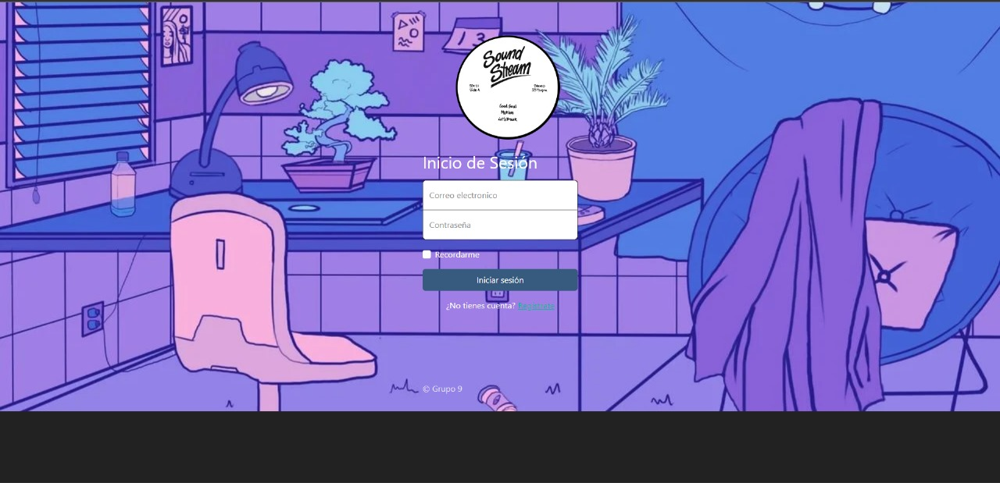
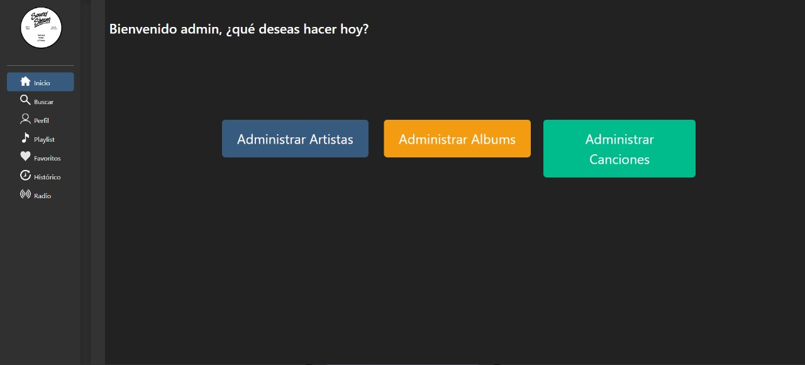
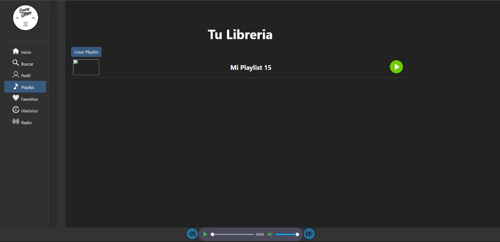
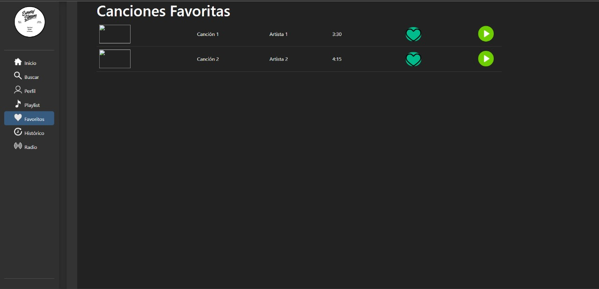
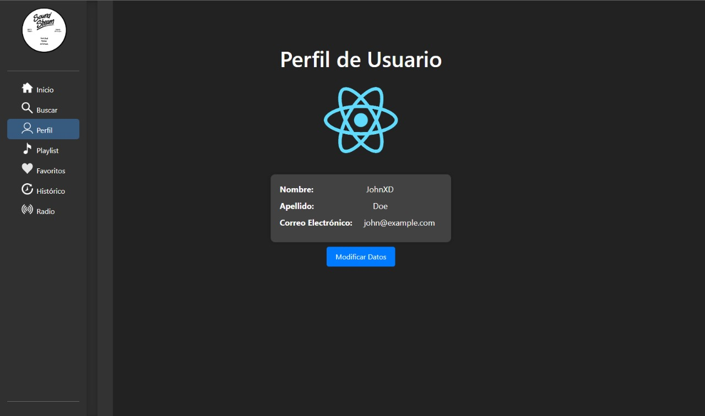
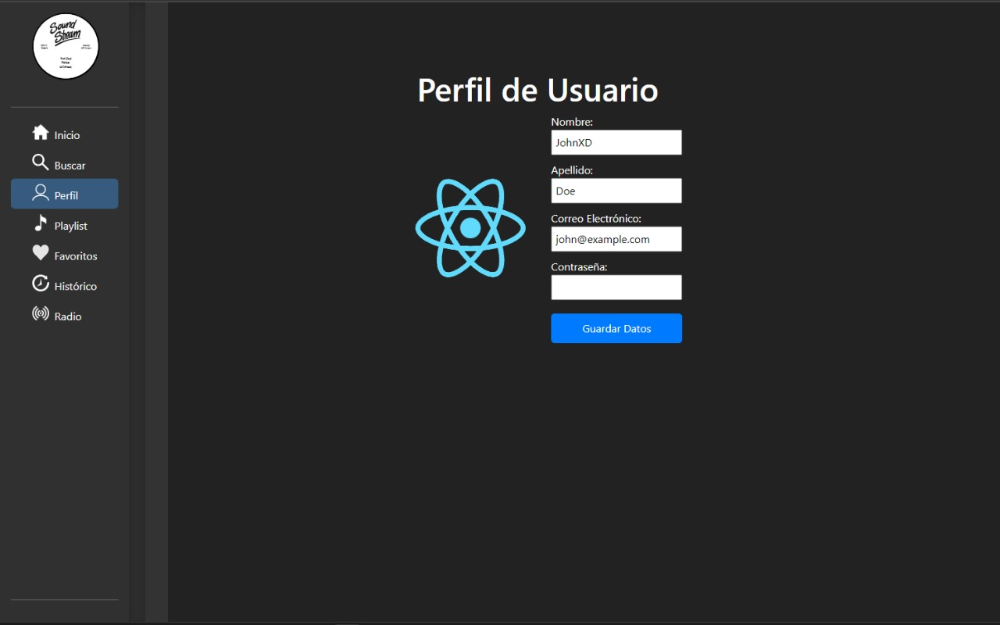
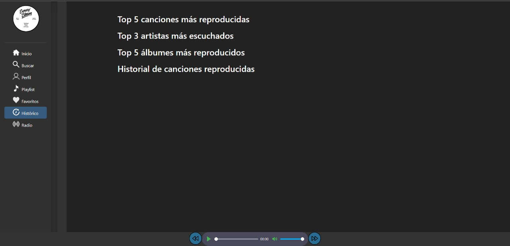

# Manual de Usuario

## Objetivos del Manual

El presente manual de usuario tiene como objetivos:

1. Proporcionar a los usuarios una guía detallada sobre cómo utilizar la aplicación de transmisión de música.
2. Facilitar la comprensión de las funciones y características disponibles en la aplicación.
3. Ayudar a los usuarios a aprovechar al máximo la experiencia de uso de la aplicación.
4. Resolver preguntas comunes y proporcionar asistencia para solucionar problemas.

## Aplicación de Transmisión de Música

La aplicación le permite disfrutar de una amplia variedad de canciones, álbumes y listas de reproducción de música de diferentes géneros. A continuación, encontrará una descripción general de las características y cómo utilizar la aplicación.

### Características Principales de la Aplicación

1. **Reproducción de Música:** Escuche sus canciones y álbumes favoritos en línea con una calidad de audio excepcional.

2. **Creación de Listas de Reproducción:** Personalice su experiencia de escucha creando listas de reproducción con sus canciones preferidas.

3. **Exploración de Catálogo:** Descubra nuevas canciones y álbumes explorando nuestro amplio catálogo musical.

4. **Gestión de Perfil:** Configure su perfil con una imagen de perfil personalizada y ajuste sus preferencias de música.

5. **Almacenamiento Seguro:** Garantizamos que sus datos y archivos multimedia se almacenan de forma segura en nuestros servidores.

## Cómo Empezar

Para comenzar a disfrutar de la música en nuestra aplicación, siga estos simples pasos:

1. **Registro:** Si es un nuevo usuario, regístrese en la aplicación proporcionando su información básica y creando una cuenta.

2. **Inicio de Sesión:** Inicie sesión en su cuenta utilizando su nombre de usuario y contraseña.

3. **Exploración de Música:** Navegue por el catálogo de canciones y álbumes o utilice la función de búsqueda para encontrar su música favorita.

4. **Reproducción de Música:** Haga clic en una canción o álbum para comenzar a reproducir música. Puede pausar, avanzar o retroceder en cualquier momento.

5. **Creación de Listas de Reproducción:** Si desea crear listas de reproducción personalizadas, explore su biblioteca musical y añada canciones a sus listas.

6. **Configuración del Perfil:** Personalice su perfil con una imagen y ajuste sus preferencias musicales en la sección de configuración de la cuenta.

# Secciones de la Aplicación

## Login

En la sección de "Login", los usuarios pueden ingresar a sus cuentas proporcionando su nombre de usuario y contraseña.

## Admin

La sección de "Admin" está diseñada para los administradores de la aplicación y les permite gestionar usuarios, contenido y configuración.

## Playlist

En la sección de "Playlist", los usuarios pueden crear y gestionar listas de reproducción personalizadas con sus canciones favoritas.

## InPlaylist

La sección "InPlaylist" muestra detalles y contenido de una lista de reproducción específica seleccionada por el usuario.

## Favoritas

En la sección "Favoritas", los usuarios pueden acceder rápidamente a sus canciones y álbumes favoritos almacenados.

## Perfil

La sección de "Perfil" permite a los usuarios ver y editar su información personal y configuración de cuenta.

## Editar Perfil

En la sección "Editar Perfil", los usuarios pueden realizar cambios en su información de perfil, como actualizar la imagen de perfil y cambiar la contraseña.

## Histórico

La sección de "Histórico" muestra un registro de las canciones que el usuario ha escuchado anteriormente.

